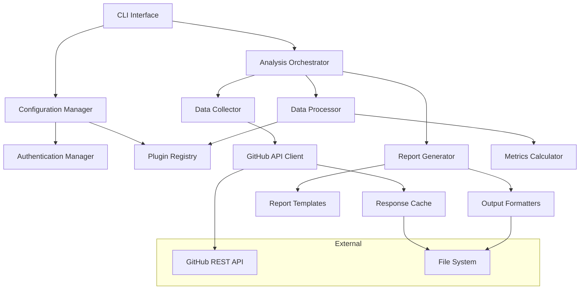

# Github Review Analyzer - Design Document

## Overview

The Github Review Analyzer is a command-line tool and GitHub Action that collects and analyzes pull request feedback metrics from GitHub repositories. It focuses on measuring the effectiveness of AI reviewer comments (starting with CodeRabbit) through comprehensive data collection and statistical analysis.

The system uses GitHub's REST API to retrieve PR data, processes comments and interactions, and generates detailed reports in multiple formats. The architecture emphasizes extensibility to support different AI reviewers and custom metrics.

## Architecture

The system follows a modular, plugin-based architecture with clear separation of concerns:



## Components and Interfaces

### Core Components

**Configuration Manager**
- Handles environment variables, config files, and CLI arguments
- Validates configuration parameters
- Manages authentication credentials securely
- Interface: `IConfigurationProvider`

**GitHub API Client**
- Abstracts GitHub REST API interactions
- Handles authentication, rate limiting, and pagination
- Provides caching for API responses
- Interface: `IGitHubClient`

**Data Collector**
- Orchestrates data retrieval from GitHub API
- Collects PRs, comments, reactions, and metadata
- Handles time period filtering and repository scoping
- Interface: `IDataCollector`

**Data Processor**
- Transforms raw GitHub data into structured metrics
- Applies filtering rules for AI reviewer identification
- Calculates engagement and effectiveness statistics
- Interface: `IDataProcessor`

**Metrics Calculator**
- Implements core metrics calculations
- Supports extensible metric definitions
- Handles statistical computations and edge cases
- Interface: `IMetricsCalculator`

**Report Generator**
- Produces reports in multiple formats (JSON, Markdown, HTML)
- Uses configurable templates
- Supports custom report layouts
- Interface: `IReportGenerator`

### Plugin System

**Plugin Registry**
- Manages metric plugins and AI reviewer configurations
- Supports runtime plugin loading
- Validates plugin compatibility
- Interface: `IPluginRegistry`

**Metric Plugin Interface**
- Defines contract for custom metrics
- Provides access to processed data
- Returns calculated metric values
- Interface: `IMetricPlugin`

## Data Models

### Core Data Structures

```typescript
interface PullRequest {
  id: number;
  number: number;
  title: string;
  state: 'open' | 'closed' | 'merged';
  createdAt: Date;
  updatedAt: Date;
  mergedAt?: Date;
  author: User;
  comments: Comment[];
}

interface Comment {
  id: number;
  body: string;
  author: User;
  createdAt: Date;
  updatedAt: Date;
  position?: number;
  path?: string;
  isResolved: boolean;
  reactions: Reaction[];
  replies: Comment[];
}

interface Reaction {
  type: 'thumbs_up' | 'thumbs_down' | 'laugh' | 'hooray' | 'confused' | 'heart' | 'rocket' | 'eyes';
  user: User;
  createdAt: Date;
}

interface User {
  login: string;
  type: 'User' | 'Bot';
  id: number;
}

interface MetricsReport {
  repository: string;
  period: DateRange;
  aiReviewer: string;
  summary: MetricsSummary;
  detailed: DetailedMetrics;
  generatedAt: Date;
}

interface MetricsSummary {
  totalPRs: number;
  totalComments: number;
  averageCommentsPerPR: number;
  positiveReactions: number;
  negativeReactions: number;
  repliedComments: number;
  resolvedComments: number;
}
```

## Correctness Properties

*A property is a characteristic or behavior that should hold true across all valid executions of a system-essentially, a formal statement about what the system should do. Properties serve as the bridge between human-readable specifications and machine-verifiable correctness guarantees.*

### Property Reflection

After analyzing all acceptance criteria, several properties can be consolidated to eliminate redundancy:

- Properties 2.1-2.7 (counting operations) can be combined into comprehensive counting properties
- Properties 2.4 and 2.5 (positive/negative reactions) can be unified into reaction classification
- Properties 4.1-4.5 (extensibility) can be grouped into plugin architecture validation
- Properties 5.1-5.5 (data accuracy) can be consolidated into data processing correctness

### Core Properties

**Property 1: Time period filtering accuracy**
*For any* repository and time period, all retrieved pull requests should have creation dates within the specified timeframe
**Validates: Requirements 1.1**

**Property 2: AI reviewer comment filtering**
*For any* set of PR comments and AI reviewer username, only comments authored by that specific username should be collected
**Validates: Requirements 1.2**

**Property 3: Comment resolution detection**
*For any* comment with resolution metadata, the system should correctly identify its resolution status
**Validates: Requirements 1.3**

**Property 4: Reaction collection completeness**
*For any* comment with emoji reactions, all reactions should be collected and associated with the comment
**Validates: Requirements 1.4**

**Property 5: Report generation consistency**
*For any* complete dataset, the system should generate a metrics report with all required sections and valid structure
**Validates: Requirements 1.5**

**Property 6: Metrics calculation accuracy**
*For any* valid dataset, calculated metrics (counts, averages, percentages) should match manual calculations of the same data
**Validates: Requirements 2.1, 2.2, 2.3, 2.7**

**Property 7: Reaction classification correctness**
*For any* set of emoji reactions, positive reactions (👍, ❤️, 🎉, 🚀) and negative reactions (👎, 😕) should be correctly classified and counted
**Validates: Requirements 2.4, 2.5**

**Property 8: Reply detection accuracy**
*For any* comment thread, human replies to AI reviewer comments should be correctly identified and counted
**Validates: Requirements 2.6**

**Property 9: Configuration parsing robustness**
*For any* valid configuration input (environment variables, files), the system should correctly parse and apply all parameters
**Validates: Requirements 3.2**

**Property 10: Output format compliance**
*For any* generated report, both human-readable and machine-readable formats should be valid and contain equivalent information
**Validates: Requirements 3.3, 3.4**

**Property 11: Plugin architecture extensibility**
*For any* valid plugin implementation, the system should load and execute it without requiring core code changes
**Validates: Requirements 4.2**

**Property 12: Username pattern flexibility**
*For any* valid username pattern configuration, the system should correctly identify AI reviewer comments using that pattern
**Validates: Requirements 4.1**

**Property 13: API response validation**
*For any* GitHub API response, the system should validate structure and handle pagination correctly
**Validates: Requirements 5.1**

**Property 14: Mathematical edge case handling**
*For any* edge case data (empty sets, zero values), statistical calculations should handle them gracefully without errors
**Validates: Requirements 5.3**

**Property 15: Credential security**
*For any* authentication token or credential, it should never appear in logs, output files, or error messages
**Validates: Requirements 6.2**

## Error Handling

The system implements comprehensive error handling across all components:

**API Errors**
- Rate limit handling with exponential backoff
- Network timeout and retry logic
- Invalid response format detection
- Authentication failure recovery

**Data Processing Errors**
- Malformed comment data validation
- Missing metadata handling
- Invalid date format processing
- Null/undefined value protection

**Configuration Errors**
- Missing required parameters validation
- Invalid date range detection
- Unsupported repository format handling
- Plugin loading failure recovery

**Output Errors**
- File system permission issues
- Invalid template format detection
- Report generation failure handling
- Format conversion error recovery

## Testing Strategy

The testing approach combines unit testing and property-based testing to ensure comprehensive coverage:

**Unit Testing**
- Component integration testing for API client interactions
- Configuration parsing validation with specific examples
- Error handling verification for known failure scenarios
- Plugin loading and execution testing with mock plugins

**Property-Based Testing**
- Uses **fast-check** library for JavaScript/TypeScript property-based testing
- Each property-based test runs a minimum of **100 iterations** to ensure statistical confidence
- Property tests focus on universal behaviors that should hold across all valid inputs
- Each property-based test includes a comment explicitly referencing the design document property

**Test Configuration**
- Property-based tests are configured to run 100+ iterations per property
- Smart generators create realistic GitHub API response data
- Edge case generators test boundary conditions (empty data, maximum values)
- Custom generators create valid configuration combinations

**Test Tagging Format**
Each property-based test must include this exact comment format:
```javascript
// **Feature: github-pr-metrics, Property 1: Time period filtering accuracy**
```

## Implementation Architecture

**Technology Stack**
- **Runtime**: Node.js with TypeScript for type safety
- **HTTP Client**: Axios with retry and rate limiting capabilities
- **Testing**: Jest for unit tests, fast-check for property-based testing
- **CLI Framework**: Commander.js for command-line interface
- **Configuration**: dotenv for environment variables, JSON/YAML for config files

**Project Structure**
```
src/
├── cli/                 # Command-line interface
├── config/             # Configuration management
├── github/             # GitHub API client
├── collectors/         # Data collection services
├── processors/         # Data processing logic
├── metrics/            # Metrics calculation engines
├── plugins/            # Plugin system implementation
├── reporters/          # Report generation
├── templates/          # Report templates
└── utils/              # Shared utilities

tests/
├── unit/               # Unit tests
├── properties/         # Property-based tests
└── fixtures/           # Test data fixtures
```

**Deployment Considerations**
- GitHub Action workflow files for automated execution
- Docker containerization for consistent environments
- Environment-specific configuration management
- Artifact storage and retrieval mechanisms